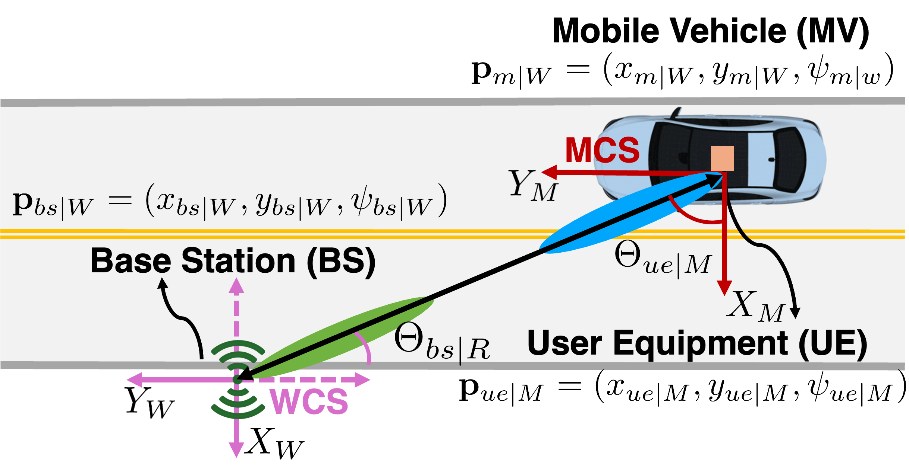

# Look Once, Beam Twice (VIBE)

**VIsion-based BEamforming for Real-Time Double-Directional mmWave V2X**


Reference implementation for the paper:

> Avhishek Biswas\*, Apala Pramanik\*, Eylem Ekici, Mehmet C. Vuran.
> *"Look Once, Beam Twice: Camera-Primed Real-Time Double-Directional mmWave Beam Management for Vehicular Connectivity."* (\*equal contribution)
>
> arXiv: <https://doi.org/10.48550/arXiv.2605.05071>

<p align="center">
  
</p>

VIBE is a hybrid model-based, closed-loop learning architecture for double-directional mmWave beam management. It combines:

1. A **camera-primed** initial beam estimate (YOLOv11 detector for base stations) to bypass the O(N²) exhaustive sweep,
2. A **radio coordinate projection** that converts the camera-frame angle into a beambook index (no offline RF training data),
3. A **lightweight closed-loop refinement** with offset tracking that adapts to mobility-induced drift and SNR thresholds in real time.

Two runtime variants of the refinement loop are provided:

- **VIBE-MA** — moving-average offset tracking. The main proposed method.
- **VIBE-MLP** — a small (3-layer) MLP that predicts the corrective offset.

VIBE is hardware-agnostic and **does not require large-scale labeled RF datasets**. It is evaluated indoors, outdoors, and on the public DeepSense 6G dataset.

---

## Quick links

- Paper (arXiv): <https://doi.org/10.48550/arXiv.2605.05071>
- [Architecture overview](docs/ARCHITECTURE.md)
- [Hardware setup](docs/HARDWARE.md)
- [Citing this work](#citation)
- [License](LICENSE)

---

## Repository layout

```text
Look-Once-Beam-Twice/
├── configurations/        # Shared config, utils, + plot_experiment.py (per-run plotting glue)
├── ground_truth_collection/  # Exhaustive sweeps used to derive Q-thresholds and labels
├── fullsweep/             # Full TX/RX baseline beam sweep + heatmap plotting
├── indoor/                # Indoor experiments (CPN Lab testbed)
│   └── continuous/        #   Rotor sweeps smoothly
│       ├── online/        #     Live-SNR runners: automatic_indoor_evaluations_{basic,mavg,mavg_absent,mlp,5gnr}/
│       └── offline/       #     Replayed-SNR runners: automatic_indoor_evaluations_{basic,mavg,mavg_absent,mlp}/
├── outdoor/               # Outdoor real-time experiments (UNL campus)
│   ├── outdoor_online_main_{basic,mavg,mlp}.py  # Canonical runners (ZMQ to remote TX)
│   ├── mlp_models/        #     Trained MLP offset datasets / scalers
│   └── alt_runners/       #     Alternative-transport runners (raw-TCP, USB-local)
├── external_eval/         # Cross-scenario evaluation on public datasets; placeholder
├── final_results/         # Curated experiment results backing the paper (CSVs, metadata, PNG plots)
├── combined_rotor_motion/ # Arduino firmware for the rotor (`D:` and `C:` protocols)
└── tx_server/             # TX-host servers + Sivers shell launcher (run on the TX machine):
    ├── tx_server_zmq.py       #   ZMQ REP at port 5555 — answers SET_TX_BEAM
    ├── tx_server_raw_tcp.py   #   raw TCP at port 5002 — same protocol, different transport
    └── start_sivers.sh        #   brings up the Sivers EVK (Eder) shell the servers drive
```

### Naming conventions

The folder and file names encode experimental conditions and algorithmic variants:

| Suffix / token | Meaning |
|---|---|
| `_basic` | **VIBE-YOLOR** baseline — camera priming + radio projection only, no closed loop |
| `_mavg`  | **VIBE-MA** — moving-average offset tracking |
| `_mlp`   | **VIBE-MLP** — learned offset prediction |
| `_5gnr`  | 5G NR hierarchical beamforming baseline |
| `_absent` | Ablation: offset history fallback disabled |
| `online` | Real-time SNR measurement |
| `offline` | Replayed pre-collected SNR |
| `automatic_indoor_evaluations_*` | A self-contained variant folder, found under `online/` (live SNR) and `offline/` (replayed SNR) |
| `continuous` | Rotor sweeps continuously without pausing |

See [docs/ARCHITECTURE.md](docs/ARCHITECTURE.md) for a full mapping of variants to source files.

---

## System overview

<p align="center">
  
</p>

## Hardware requirements

VIBE was evaluated on the following hardware. Most code paths have hooks that should generalize, but the timings and gains in `configurations/config.py` and the per-folder `sivers_control.py` are tuned for this stack.

| Component | Model |
|---|---|
| mmWave front-end (TX & RX) | Sivers Semiconductors EVK06002, 60 GHz, n263 FR2 |
| Baseband SDR | Ettus USRP B200-mini |
| Camera (NFOV) | Intel RealSense D435 (60° FOV) |
| Camera (WFOV) | Luxonis OAK-D (90° FOV) |
| Rotor | Servo on Arduino, controlled via `/dev/ttyACM0` @ 115200 baud |
| UE-side compute | Embedded host (mini-PC / SBC) with ZMQ link to TX |

See [docs/HARDWARE.md](docs/HARDWARE.md) for wiring, calibration, and beam-book details.

---

## Software setup

```bash
# 1. Clone
git clone https://github.com/UNL-CPN-Lab/Look-Once-Beam-Twice.git
cd Look-Once-Beam-Twice

# 2. Python dependencies
python3 -m venv .venv
source .venv/bin/activate
pip install -r requirements.txt

# 3. UHD (USRP driver) — install separately, not via pip
#    https://files.ettus.com/manual/page_install.html
#    Verify with:  uhd_find_devices

# 4. Sivers EVK06002 — vendor SDK, not redistributed here.
#    The interactive Sivers shell is launched via `pexpect` from sivers_control.py.

# 5. (Optional) YOLOv11 weights for the BS detector
#    Place fine-tuned weights for the four classes
#    (mmWave radio, TG-Sounder, 5G small cell, urban streetlight) under `models/`.
```

### Configure paths

Before running anything, edit [configurations/config.py](configurations/config.py):

- `PROJECT_ROOT` — set to the absolute path of this repo on your machine.
- `JETSON_IP`, `NUC_IP`, `PORT` — match your network setup.
- `serial_port` — match the rotor's USB port (default `/dev/ttyACM0`).
- `GROUND_TRUTH_NAME` — the experiment ID for the ground-truth sweep being evaluated.

---

## Quickstart

### 1. Capture ground truth (one-time per environment)

Performs an exhaustive 64×64 TX/RX double-directional sweep over the rotor range. The resulting CSV is used both as a label source for offset training and to derive the Q-quantile SNR thresholds (Q0.80, Q0.90, Q0.95).

```bash
cd ground_truth_collection
python3 BeamSweeponRotor.py
```

### 2. Run a real-time experiment

**Indoor, VIBE-MA, fully automated sweep over thresholds + speeds (recommended):**

```bash
cd indoor/continuous/online/automatic_indoor_evaluations_mavg
python3 automatic_mavg_main.py
```

**Outdoor, VIBE-MA:**

```bash
cd outdoor
python3 outdoor_online_main_mavg.py
```

### 3. Inspect results

Each experiment writes per-run SNR and beam-index CSVs under its `Adaptive_Beamforming_SC/` (indoor) or `Outdoor_Adaptive_Beamforming_SC/` (outdoor) output directory. Column conventions are documented inline in the runners that emit them. After each run the orchestrators shell out to [configurations/plot_experiment.py](configurations/plot_experiment.py) to emit per-experiment SNR heatmaps and summary plots alongside the CSVs.

The curated results backing the paper's figures and tables are checked in under [final_results/](final_results/), organized into three trees — `ONLINE_INDOOR_RESULTS/`, `OFFLINE_INDOOR_RESULTS/`, and `ONLINE_OUTDOOR_RESULTS/` — each split by VIBE variant (`VIBE_MA`, `VIBE_MA_ABS`, `VIBE_MLP`, `VIBE_YOLOR`). Every tree and variant folder has a README mapping it back to the runner that produced it. See [final_results/README.md](final_results/README.md) for the full layout.

---

## Citation

If you use this code or build on this work, please cite:

```bibtex
@inproceedings{biswas2026look,
  title     = {Look Once, Beam Twice: Camera-Primed Real-Time Double-Directional
               mmWave Beam Management for Vehicular Connectivity},
  author    = {Biswas, Avhishek and Pramanik, Apala and Ekici, Eylem and Vuran, Mehmet C.},
  booktitle = {Proc. IEEE SECON},
  year      = {2026}
}
```

A `CITATION.cff` is also provided.

---

## License

This project is released under the [MIT License](LICENSE).

---

## Acknowledgments

This work was conducted at the **Cyber Physical Networking (CPN) Lab**, School of Computing, University of Nebraska–Lincoln, with collaboration from The Ohio State University. The authors thank Sivers Semiconductors, Ettus Research, and the open-source UHD, YOLO, and PyTorch communities.
