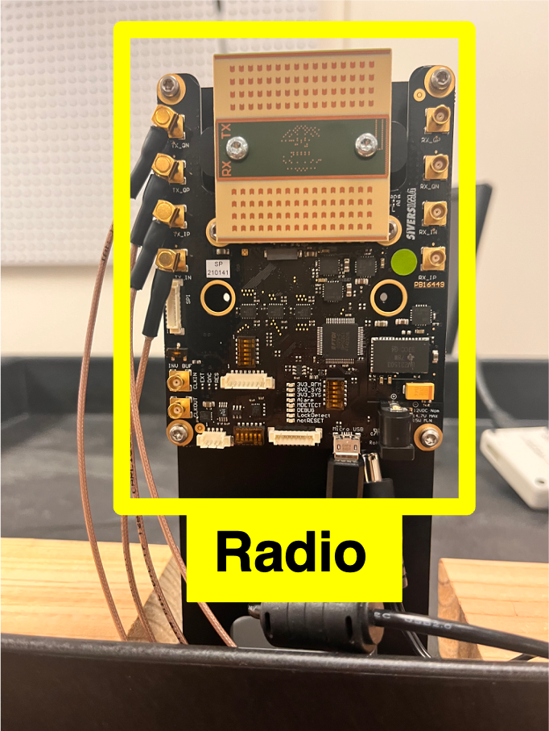
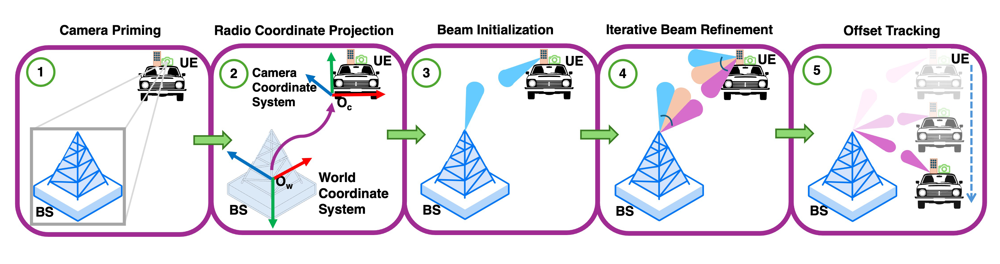

# YOLOR-radio


<table>
<tr>
<td width="30%" valign="top">

</td>
<td valign="top">

**YOLOR-radio** is a fine-tuned object detection model for BS identification for beam initialization to detect `radio` in one inference pass. The model is trained on imagery of **[Sivers Semiconductors](https://www.sivers-semiconductors.com/) 60 GHz mmWave Radio frontends (EVK06002)**. Part of the YOLOR detector family used for the Look Once, Beam Twice mmWave V2X beam-management pipeline (SECON 2026).

</td>
</tr>
</table>


Reference implementation for the paper:

> Avhishek Biswas\*, Apala Pramanik\*, Eylem Ekici, Mehmet C. Vuran.
> *"Look Once, Beam Twice: Camera-Primed Real-Time Double-Directional mmWave Beam Management for Vehicular Connectivity."* (\*equal contribution)
>
> arXiv: <https://doi.org/10.48550/arXiv.2605.05071>

<p align="center">
  
</p>

## Quick links

- Paper (arXiv): <https://doi.org/10.48550/arXiv.2605.05071>
Code and Data: <https://github.com/UNL-CPN-Lab/Look-Once-Beam-Twice>

| | |
|---|---|
| **Architecture** | YOLOv11x, 81-class output head (COCO 80 + 1 custom) |
| **Initialization** | stock `yolo11x.pt` |
| **Schedule** | 200 epochs, `cos_lr`, `close_mosaic=20`, `lr0=0.01` |
| **Training data** | IndoorCOTSDataset — 3,599 train / 449 val / 451 test |
| **Custom classes** | `radio` (id 80) |
| **Released checkpoint** | `last.pt` (the converged final model) |

## Usage

```python
from huggingface_hub import hf_hub_download
from ultralytics import YOLO

weights = hf_hub_download(repo_id="<org>/YOLOR-radio", filename="last.pt")
model = YOLO(weights)

results = model.predict("path/to/image.jpg", conf=0.25)
results[0].show()
```

Class indices in the returned detections: `0–79` are the standard COCO
classes; `80` is `radio`. The model's `names` dict carries the same
mapping.

## Intended use

- Stage-1 BS-candidate detector for the Look Once, Beam Twice detector pipeline.
- General-purpose RF-hardware-aware object detection in indoor / office
  scenes where both COCO objects and RF radios may appear.


## Citation

```bibtex
@inproceedings{biswas2026look,
  title     = {Look Once, Beam Twice: Camera-Primed Real-Time Double-Directional
               mmWave Beam Management for Vehicular Connectivity},
  author    = {Biswas, Avhishek and Pramanik, Apala and Ekici, Eylem and Vuran, Mehmet C.},
  booktitle = {Proc. IEEE SECON},
  year      = {2026}
}
```

Paper: <https://doi.org/10.48550/arXiv.2605.05071> · Code: <https://github.com/UNL-CPN-Lab/Look-Once-Beam-Twice>

## Contact

For questions about this model or the paper, contact the corresponding authors:

- **Avhishek Biswas** — [abiswas3@huskers.unl.edu](mailto:abiswas3@huskers.unl.edu)
- **Apala Pramanik** — [apramanik2@huskers.unl.edu](mailto:apramanik2@huskers.unl.edu)

## Acknowledgments

Developed at the **[Cyber Physical Networking (CPN) Lab](https://cpn.unl.edu/)**, [School of Computing](https://computing.unl.edu/), [University of Nebraska–Lincoln](https://www.unl.edu/), in collaboration with [The Ohio State University](https://www.osu.edu/). Thanks to [Sivers Semiconductors](https://www.sivers-semiconductors.com/), [Ettus Research](https://www.ettus.com/), and the open-source [Ultralytics](https://ultralytics.com/), [PyTorch](https://pytorch.org/), and [Ettus UHD](https://www.ettus.com/) communities.
