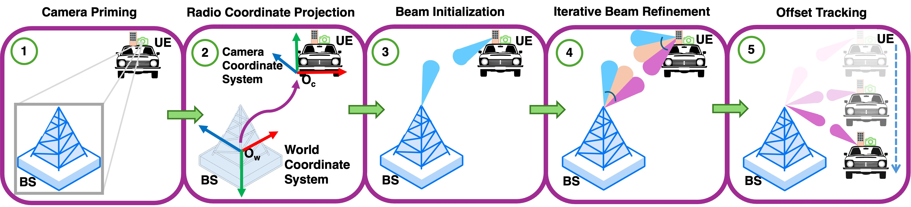

# VIBE Architecture

This document describes the five-stage VIBE pipeline and maps each stage to the source files in this repository.

---

## The five stages

<p align="center">
  
</p>

The canonical end-to-end runner is [indoor/continuous/online/automatic_indoor_evaluations_mavg/continuous_online_main_mavg.py](../indoor/continuous/online/automatic_indoor_evaluations_mavg/continuous_online_main_mavg.py); the row references below point into it.

| # | Stage | Implementation |
|---|---|---|
| 1 | **Camera priming** — YOLOv11 detector returns BS bounding boxes `(x_c, y_c, ℓ, c)` | YOLO inference inside the `YOLO_RX` thread in [continuous_online_main_mavg.py](../indoor/continuous/online/automatic_indoor_evaluations_mavg/continuous_online_main_mavg.py); detector class is `VIBE-YOLOR`. |
| 2 | **Radio coordinate projection** — pinhole camera model maps `x_c` → CCS azimuth, then to MCS, then to RCS. | `configurations/utils.py` (helpers) plus the `pixel_to_angle()` / `angle_to_beam()` blocks inside [continuous_online_main_mavg.py](../indoor/continuous/online/automatic_indoor_evaluations_mavg/continuous_online_main_mavg.py); uses `PIXEL_PITCH`, `FX_MM`, `CX` from `configurations/config.py`. |
| 3 | **Beam initialization** — quantize RCS azimuth to the nearest UE beambook index; BS uses the opposite azimuth. | `RX_BEAM_ANGLES` / `TX_BEAM_ANGLES` in [configurations/config.py](../configurations/config.py); `nearest_beam_index()` in `configurations/utils.py`; called from [continuous_online_main_mavg.py](../indoor/continuous/online/automatic_indoor_evaluations_mavg/continuous_online_main_mavg.py). |
| 4 | **Iterative beam refinement** — alternating ±1, ±2, … local sweep against threshold `γ_th`. | `search_nearby_beams()` in [continuous_online_main_mavg.py](../indoor/continuous/online/automatic_indoor_evaluations_mavg/continuous_online_main_mavg.py); analogous logic in the `*_mlp.py` runners. In basic runners it is a one-shot ±k search. |
| 5 | **Offset tracking** — moving average over recent successful offsets (or MLP inference). | `beam_offset_history = deque(maxlen=10)` in [continuous_online_main_mavg.py](../indoor/continuous/online/automatic_indoor_evaluations_mavg/continuous_online_main_mavg.py); MLP weights at [indoor/continuous/online/automatic_indoor_evaluations_mlp/](../indoor/continuous/online/automatic_indoor_evaluations_mlp/) and [outdoor/](../outdoor/) (`offset_mlp_model_*.pt`, `offset_scaler_*.pkl`). |

---

## Variants of stages 4–5

Three runtime variants of the closed-loop refinement are provided:

| Variant | Algorithm | File suffix | Runner examples |
|---|---|---|---|
| **VIBE-YOLOR** | Stages 1–3 only — no closed loop | `*_basic.py` | [continuous_online_main_basic.py](../indoor/continuous/online/automatic_indoor_evaluations_basic/continuous_online_main_basic.py), [outdoor_online_main_basic.py](../outdoor/outdoor_online_main_basic.py) |
| **VIBE-MA** | Moving-average offset history | `*_mavg.py` | [continuous_online_main_mavg.py](../indoor/continuous/online/automatic_indoor_evaluations_mavg/continuous_online_main_mavg.py), [outdoor_online_main_mavg.py](../outdoor/outdoor_online_main_mavg.py) |
| **VIBE-MLP** | 3-layer FC net (LayerNorm + ReLU + dropout, Smooth L1, Adam) predicting offset | `*_mlp.py` | [continuous_online_main_mlp.py](../indoor/continuous/online/automatic_indoor_evaluations_mlp/continuous_online_main_mlp.py), [outdoor_online_main_mlp.py](../outdoor/outdoor_online_main_mlp.py) |

---

## Experimental conditions

| Condition | Folder | Notes |
|---|---|---|
| **Indoor** (continuous rotor) | [indoor/continuous/](../indoor/continuous/) | UE on motorized rotor moving continuously at 0.25 / 1 / 4 °/s. |
| **Outdoor, real-time** | [outdoor/](../outdoor/) | UNL campus 80 m straight path at 1.6 / 8.0 / 12.8 °/s. |
| **External / cross-scenario** | [external_eval/](../external_eval/) | Evaluation on public datasets (DeepSense 6G Scenarios 6, 7, 9) against MNet-LeNet and ResNet-50 baselines. |
| **Online vs offline** | `online/` vs `offline/` (under `indoor/continuous/`) | **Online** = real-time SNR measurement during the experiment. **Offline** = replayed SNR from a pre-collected ground-truth sweep. |
| **5G NR baseline** | [indoor/continuous/online/automatic_indoor_evaluations_5gnr/](../indoor/continuous/online/automatic_indoor_evaluations_5gnr/) | Hierarchical beamforming reference. |
| **Ablation: no history fallback** | `*_mavg_absent` | VIBE-MA without history fallback. |

> **Note on the word "automatic":** every variant folder under `online/` or `offline/` is named `automatic_indoor_evaluations_<variant>` because each is driven by an *automated* runner — the orchestrator captures (or replays) ground truth, derives Q-thresholds, and runs the live experiment end-to-end. Whether SNR is measured live or replayed depends on which parent folder (`online/` or `offline/`) the variant lives under.

---

## Indoor experiment tree

The indoor folder uses a continuous-rotor evaluation tree: each algorithmic variant lives in its own self-contained folder, mirrored under `online/` (live SNR) and `offline/` (replayed SNR).

```
indoor/
└── continuous/                                            ← rotor sweeps continuously
    ├── online/                                            ← live-SNR measurement
    │   ├── automatic_indoor_evaluations_5gnr/             ←   5G NR baseline
    │   ├── automatic_indoor_evaluations_basic/            ←   VIBE-YOLOR (camera priming only)
    │   ├── automatic_indoor_evaluations_mavg/             ←   VIBE-MA
    │   ├── automatic_indoor_evaluations_mavg_absent/      ←   VIBE-MA ablation (no history fallback)
    │   └── automatic_indoor_evaluations_mlp/              ←   VIBE-MLP
    └── offline/                                           ← SNR replayed from pre-collected ground truth
        ├── automatic_indoor_evaluations_basic/            ←   VIBE-YOLOR
        ├── automatic_indoor_evaluations_mavg/             ←   VIBE-MA
        ├── automatic_indoor_evaluations_mavg_absent/      ←   VIBE-MA ablation
        └── automatic_indoor_evaluations_mlp/              ←   VIBE-MLP
```

Quick legend:

- **basic** = VIBE-YOLOR (Stages 1–3 only — camera priming + projection + beam init, **no** closed-loop refinement).
- **mavg** = VIBE-MA (moving-average offset history).
- **mavg_absent** = VIBE-MA ablation: history fallback path disabled.
- **mlp** = VIBE-MLP (offset predicted by a 3-layer MLP).
- **5gnr** = 5G NR hierarchical beamforming reference (online only).
- The 5G NR baseline does **not** have an offline counterpart by design — it is only meaningful with real-time SNR.

---

## Ground truth

Every evaluation references a **ground truth SNR table** captured with an exhaustive 64×64 TX/RX double-directional sweep over the rotor's angular range:

- Capture script: [ground_truth_collection/BeamSweeponRotor.py](../ground_truth_collection/BeamSweeponRotor.py).
- Output CSVs (under `Adaptive_Beamforming_SC/<GROUND_TRUTH_NAME>/`):
  - `forward_all_snr_data.csv` — all (rotor angle, TX, RX) → SNR.
  - `forward_max_snr_per_angle.csv` — max-SNR beam per rotor angle.
- Q-quantile thresholds (Q0.80, Q0.90, Q0.95) are derived from this distribution and stored in [configurations/config.py](../configurations/config.py) as `SNR_QUANTILE`.

---

## Latency budget

End-to-end VIBE pipeline measured at **0.231 s** on the prototype hardware:

| Stage | Source | Budget |
|---|---|---|
| Image capture + YOLO inference | Camera + GPU | **75 ms (40%)** |
| UE beam set | `sivers_control.py` `set_beam` (per-folder copy in each runner directory) | 50 ms (26.5%) |
| BS beam set | [tx_server/tx_server_zmq.py](../tx_server/tx_server_zmq.py) round-trip | 50 ms (26.5%) |
| Beam stabilization + SNR | RX streamer + power calc | 35 ms (18.6%) |
| Sub-6 GHz signaling, ACKs, etc. | (combined) | 21 ms (8%) |

The image-processing and beam-set stages are hardware-bound. The VIBE algorithm itself contributes negligible CPU time.

---

## File-by-file inventory of the algorithm core

| File | Role |
|---|---|
| [configurations/config.py](../configurations/config.py) | Constants — beambook tables, network IPs, paths, SNR quantile, gain/distance metadata. |
| [configurations/utils.py](../configurations/utils.py) | SNR computation (`calculate_power_metrics`, `calculate_snr_with_min_noise_window`), interactive shell helpers (`run_interactive_command`), rotor timing (`get_rotation_time_ms`), threshold conversion (`snr_percent_db`). |
| `sivers_control.py` (per-folder) | TX/RX init: spawn the Sivers shell via pexpect, set frequency to 60.48 GHz, configure baseband + RF gains, enable streams. Each runner directory carries its own copy. |
| `usrp_control.py` (per-folder) | USRP B200-mini: stream init, gain, sample rate. |
| `combined_continuous_discrete_rotor.py` (per-folder where used) | Arduino rotor driver — sends `D:<deg>` (step-and-stop) / `C:<ms>` (continuous sweep) commands. |
| [tx_server/tx_server_zmq.py](../tx_server/tx_server_zmq.py) | TX-host server. Spawns the Sivers TX shell and answers `START_TX` / `SET_TX_BEAM:<idx>` over a ZMQ REP socket (port 5555). Run on the TX-side machine. |
| [tx_server/tx_server_raw_tcp.py](../tx_server/tx_server_raw_tcp.py) | Same as above but over a raw TCP socket (port 5002). Used by the `tcp_*` and `fullsweep` runners. |
| `imports.py` (per-folder) | Centralized imports used by all runners (`from imports import *`). |
| `*_basic.py` runners | VIBE-YOLOR (no closed loop). |
| `*_mavg.py` runners | VIBE-MA — moving-average offset tracking. |
| `*_mlp.py` runners | VIBE-MLP — same skeleton as MA but the offset comes from the trained MLP. |
| [configurations/plot_experiment.py](../configurations/plot_experiment.py) | Per-experiment SNR heatmap + summary metrics, emitted alongside each runner's CSV. Runners invoke it via `subprocess.run(["python3", PLOT_EXPERIMENT])` (path set in `config.py`). |

---

## Coordinate-system reference

| Frame | Origin | Used for |
|---|---|---|
| **WCS** (World) | East/North reference | Global positions of MV, BS, UE, camera. |
| **MCS** (Mobile) | Vehicle frame | Camera and UE radio mounted on the vehicle. |
| **CCS** (Camera) | Camera optical center | Pixel-to-angle conversion. |
| **RCS** (Radio) | Antenna boresight | Beambook angles `Θ^(k)_ue\|R`, `Θ^(k)_bs\|R`. |

The two important transforms in code:

- **CCS → RCS**: `θ_ue|R = θ_ue|C + ψ_c|M − ψ_r|M`. Vehicle yaw cancels because both sensors are body-mounted.
- **RCS angle → beam index**: nearest entry in `RX_BEAM_ANGLES`.
