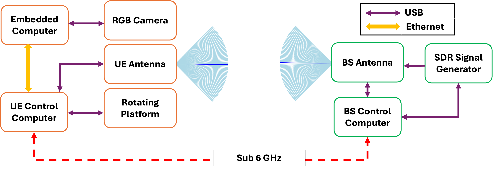

# Hardware Setup

VIBE was prototyped and evaluated on the following hardware. Most of the algorithm is portable, but the timings, gains, and beambook tables in this repo are tuned for this stack.

---

## System diagram

```
                       sub-6 GHz control link (k_ue)
        ┌──────────────────────────────────────────────────┐
        │                                                  ▼
   ┌────┴────────┐    ZMQ      ┌─────────────────┐   ┌─────────────┐
   │ UE host     │ ──────────► │ TX host         │ → │ Sivers TX   │
   │ (embedded)  │             │                 │   │ EVK06002    │
   │             │             │                 │   │ + USRP B200 │
   │             │             └─────────────────┘   │  -mini      │
   │ + Camera    │                                   └─────────────┘
   │ + USRP +    │                                          ⬇ 60 GHz
   │ Sivers RX   │ ◄────────── 60 GHz mmWave  ─────────────╯
   │ + Rotor     │
   └─────────────┘
        ▲ Arduino rotor (USB serial)
```

---

## Components

<p align="center">
  
</p>

### mmWave front-end — Sivers EVK06002 (×2)

- 60 GHz, n263 FR2 band.
- 64 analog beams spanning ±45° azimuth in 1.5° steps.
- Half-power beamwidth: **6° azimuth, 18° elevation**.
- Center frequency used in this repo: **60.48 GHz**.
- Driven via the vendor's interactive Python shell, launched with `pexpect` from [sivers_control.py](../indoor/continuous/online/automatic_indoor_evaluations_mavg/sivers_control.py).
- Beam is set with `eder.tx.set_beam(<idx>)` / `eder.rx.set_beam(<idx>)`.
- Gains are written via `eder.regs.wr('tx_bb_iq_gain', ...)` etc. Values are tuned per experiment for target distance and link budget; see the per-folder copies of [sivers_control.py](../indoor/continuous/online/automatic_indoor_evaluations_mavg/sivers_control.py).

### Baseband — Ettus USRP B200-mini

- Full-duplex SDR providing IQ samples at the IF.
- Sample rate, gain, and center frequency are set in [uhd_conf.py](../indoor/continuous/online/automatic_indoor_evaluations_mavg/uhd_conf.py) and applied in [usrp_control.py](../indoor/continuous/online/automatic_indoor_evaluations_mavg/usrp_control.py).
- Streamer is configured for `complex64` (`np.complex64`) IQ vectors of length `SAMPLE_SIZE = 2000` (see [configurations/config.py](../configurations/config.py)).

### Cameras

Two cameras are used interchangeably to evaluate FOV sensitivity:

| Model | FOV | Use |
|---|---|---|
| Intel RealSense D435 | 60° (NFOV) | Default for outdoor experiments and most indoor runs. |
| Luxonis OAK-D | 90° (WFOV) | WFOV evaluation; gives wider angular coverage at lower angular resolution. |

Calibration (`PIXEL_PITCH`, `FX_MM`, `CX`) is set in [configurations/config.py](../configurations/config.py); the active values are for the RealSense by default. Calibration files (`camera_matrix.npy`, `dist_coeffs.npy`) are not committed — generate them with OpenCV on your camera.

### Rotor (target / UE motion emulation)

- Servo driven by Arduino, exposed as a USB-serial device (default `/dev/ttyACM0`, 115200 baud).
- Two command modes, both used by the indoor runners (one for ground-truth angle positioning, the other for live experiment sweeps):
  - `D:<degrees>\n` — step to `<degrees>` and stop. Used during the optimized beam sweep to dwell at each target angle.
  - `C:<milliseconds>\n` — sweep continuously over `<milliseconds>` ms. Used during the live experiment.
- Host-side driver is [combined_continuous_discrete_rotor.py](../indoor/continuous/combined_continuous_discrete_rotor.py); Arduino firmware is in [combined_rotor_motion/](../combined_rotor_motion/).
- Default rotor speeds: 0.25 / 1 / 4 °/s (indoor), 1.6 / 8.0 / 12.8 °/s (outdoor).

### UE-side compute

A small fanless host (e.g. mini-PC or single-board computer) running the UE-side YOLO inference and SNR measurement loop. The TX host runs [tx_server/tx_server_zmq.py](../tx_server/tx_server_zmq.py) (ZMQ REP at port 5555) to receive beam-index commands from the UE-side runners; for the raw-TCP `tcp_*` variants the TX host instead runs [tx_server/tx_server_raw_tcp.py](../tx_server/tx_server_raw_tcp.py) at port 5002. Those servers bring up the Sivers front-end via [tx_server/start_sivers.sh](../tx_server/start_sivers.sh).

---

## Wiring & ports

| Cable / interface | Source | Destination | Notes |
|---|---|---|---|
| USB 3 | Intel RealSense / OAK-D | UE host | Camera. |
| USB | Arduino | UE host | Rotor (`/dev/ttyACM0`). |
| USB 3 | USRP B200-mini | UE host (RX) / TX host (TX) | High-bandwidth IQ. |
| Ethernet | UE host ↔ TX host | — | ZMQ control. Set `JETSON_IP` / `NUC_IP` in `config.py`. |
| Coax (40 GHz) | USRP IF out | Sivers IF in | Through phase-stable cable. |

---

## Calibration workflow

1. **Camera intrinsics.** Use OpenCV's checkerboard calibration to produce `camera_matrix.npy` / `dist_coeffs.npy`. Update `PIXEL_PITCH`, `FX_MM`, `CX` in `configurations/config.py` to match your camera.

2. **Camera ↔ radio yaw alignment.** Mount both sensors with parallel boresights so the `ψ_c|M − ψ_r|M` term in the CCS→RCS transform is zero (or a known constant for your mount).

3. **Beambook ground truth (per environment).**
   ```bash
   cd ground_truth_collection
   python3 BeamSweeponRotor.py
   ```
   This sweeps all 64 RX beams × 64 TX beams for each rotor angle and produces `forward_all_snr_data.csv` and `forward_max_snr_per_angle.csv`.

4. **Reference SNR.** From the boresight range `[-30°, +30°]` in `forward_max_snr_per_angle.csv`, compute the average max-SNR. This is written automatically into `reference_max_snr_db` in `config.py` by the `automatic_*_main.py` scripts.

5. **Q-thresholds.** Compute Q0.80 / Q0.90 / Q0.95 from the SNR distribution in `forward_all_snr_data.csv` (e.g. `numpy.quantile`); these populate the `SNR_FACTORS` list in the automatic runners.

---

## Tested configurations

| Item | Tested with |
|---|---|
| OS | Ubuntu 20.04 / 22.04 |
| Python | 3.8 / 3.9 / 3.10 |
| UHD | 4.x |
| CUDA (for YOLO) | 11.x or 12.x (optional, CPU also works) |
| NVIDIA GPU | NVIDIA A2000 (12 GB) for benchmarking; Jetson Orin Nano supported for edge deployment |
