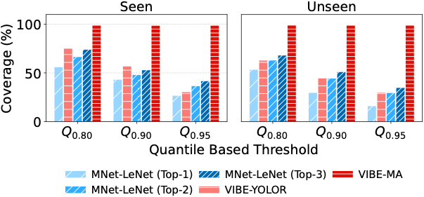

# External Evaluation — VIBE on DeepSense 6G (Scenarios 6, 7, 9)

Companion code for:

> **Look Once, Beam Twice: Camera-Primed Real-Time Double-Directional mmWave
> Beam Management for Vehicular Connectivity**
> Avhishek Biswas\, Apala Pramanik\, Eylem Ekici, Mehmet C. Vuran
> *Proc. IEEE SECON 2026.*
> Paper: <https://arxiv.org/pdf/2605.05071>

This folder reproduces the **cross-scenario generalisation study** (Table II
and Fig. 11 of the paper). On the public **DeepSense 6G** dataset it compares
VIBE against two prior camera-based beam-prediction baselines, on the *same*
images and the *same* ground-truth mmWave power vectors:

| Method | What it is |
|---|---|
| **ResNet-50** | Vision baseline, Charan *et al.*, WCNC 2021 (paper ref. [22]) |
| **MobileNet+LeNet** | Segmentation→LeNet baseline, Imran *et al.*, ICC-W 2023 (ref. [29]) |
| **VIBE-YOLOR** | VIBE's camera priming + radio-coordinate projection (no closed loop) |
| **VIBE-MA** | VIBE-YOLOR **+** the closed-loop moving-average offset tracking |

Scenario 6 / 7 are *seen* by the respective baseline; **Scenario 9 is the
unseen generalisation test** for everything.

<p align="center">
  
</p>

---

## What is a *“pass”*?

DeepSense 6G ships each scenario as long, time-ordered capture sequences. To
evaluate **beam tracking under motion**, the frames are regrouped into
`passNN/` folders. **One pass = one continuous drive-by** of the transmitter
past the receiver: a contiguous, time-ordered run of frames forming a single
trajectory. `sort_data_in_pass.py` builds these folders from `scenarioX.csv`
using the dataset’s `seq_index`. The evaluation runs **pass-by-pass**, and the
VIBE-MA offset state is **reset at the start of every pass** (each pass is an
independent trajectory, so no offset should carry across passes).

---

## 1. Get the data & weights (not shipped here)

Nothing large is committed to this repo. You supply:

**a) DeepSense 6G scenarios** — from <https://www.deepsense6g.net/> (free
account). Download Scenario **6**, **7**, **9** (camera + mmWave). Each
scenario must provide `scenarioX.csv`, `unit1/camera_data_passes/passNN/*.jpg`,
`unit1/mmWave_data/*.txt`, and `resources/annotations/bbox/*.txt`.

**b) Baseline model code & weights** — from the original authors’ repos:

| Baseline | Files to fetch | Upstream repo |
|---|---|---|
| ResNet-50 (ref. [22]) | **`build_net.py`** (the ResNet-50 builder, a DeepSense artifact) **and** the `CNN_beam_pred` weights | <https://github.com/gourangc/Vision-Position-Beam-Prediction> |
| MobileNet+LeNet (ref. [29]) | `LeNet5_64_beam` weights | <https://github.com/convexoptimist/Environment-Semantic-Communication-> |

> **`build_net.py` is required by the two ResNet-50 notebooks** (`from
> build_net import resnet50`). It is a DeepSense 6G baseline artifact and is
> **not redistributed here** — download it from the repo above and drop it
> next to the notebooks (the CONFIG cell puts that folder on `sys.path`). The
> notebooks raise a clear, actionable error if it is missing.

(The MobileNet-V2 segmentation model and YOLOv11 download automatically on
first run via `transformers` / `ultralytics`.)

---

## 2. Tell the notebooks where the data is

Every notebook has **one `CONFIG` cell near the top — that is the only cell
you edit.** By default it expects the data beside the notebook:

```
external_eval/
├── Scenario6/                       # DeepSense 6G Scenario 6
│   ├── scenario6.csv
│   ├── unit1/{camera_data_passes,mmWave_data}/
│   ├── resources/annotations/bbox/
│   └── image_beam/.../checkpoint/CNN_beam_pred        # ResNet-50 weights
├── scenario9/scenario9_dev/         # DeepSense 6G Scenario 9 (same shape)
├── scenario7/
│   ├── DEV[95]/                     # DeepSense 6G Scenario 7
│   └── saved_folder/.../checkpoint/LeNet5_64_beam     # LeNet weights
```

If your data lives elsewhere, **don’t edit code** — just set an environment
variable before launching Jupyter:

```bash
export DEEPSENSE_SCENARIO6_ROOT=/data/DeepSense6G/Scenario6
export DEEPSENSE_SCENARIO7_ROOT=/data/DeepSense6G/scenario7
export DEEPSENSE_SCENARIO9_ROOT=/data/DeepSense6G/scenario9/scenario9_dev
```

The CONFIG cell prints `[WARN]` lines for any path it cannot find, so you get
actionable feedback before anything runs.

---

## 3. Repository contents

**Evaluation notebooks** (each: ResNet-50 *or* MNet+LeNet vs. VIBE-YOLOR vs. VIBE-MA)
- `ExternalEvalScenario6_ResNet50_VIBE.ipynb` — Scenario 6 (seen by ResNet-50)
- `ExternalEvalScenario9_ResNet50_VIBE.ipynb` — Scenario 9 (unseen)
- `ExternalEvalScenario7_MNetLeNet_VIBE.ipynb` — Scenario 7 (seen by MNet-LeNet)
- `ExternalEvalScenario9_MNetLeNet_VIBE.ipynb` — Scenario 9 (unseen; LeNet trained on Sc. 7)
- `PlotsforPaper.ipynb` — builds Fig. 11 (coverage, seen vs. unseen) from the roll-up CSVs

**Helpers**
- `sort_data_in_pass.py` — regroups DeepSense frames into `passNN/` folders
- `build_net.py` — *not shipped* (DeepSense baseline artifact); the ResNet-50
  notebooks require it — fetch it per §1 and place it next to the notebooks

**Outputs (created by the notebooks)**
- `ResNet50ModelAnalysis/` — per-Q and roll-up CSVs for the ResNet-50 runs
- `MNet_LeNet_Model_Analysis/` — per-Q and roll-up CSVs for the MNet-LeNet runs
- `FinalPlots/` — `Success_S7_S9.{png,pdf,svg}` (Fig. 11)

> Each notebook’s structure: **CONFIG → helpers → models → `process_image()`
> → driver loop → roll-up**. The per-image logic is one well-documented
> `process_image()` function; the driver just enumerates passes and collects
> rows.

---

## 4. Environment

Python 3.10+ with conda or venv:

```bash
conda create -n vibe python=3.10 -y && conda activate vibe
pip install -U numpy pandas matplotlib pillow jupyter
# PyTorch — pick the build matching your CUDA driver (or the CPU build):
pip install torch torchvision --index-url https://download.pytorch.org/whl/cu121
pip install ultralytics transformers
```

A CUDA GPU is recommended (ResNet-50 / MobileNet inference). The notebooks
fall back to CPU with a warning if CUDA is unavailable.

---

## 5. How to run

1. `jupyter lab` and open an evaluation notebook.
2. Edit the **CONFIG** cell only (or set the env var from §2).
3. Set `quantile_percentile` to `0.80`, run all cells; repeat for `0.90` and
   `0.95`. Each run writes one per-Q CSV; the last cell rolls the three into a
   `combined_outage_timing_summary_*.csv`.
4. Repeat for all four evaluation notebooks.
5. Run `PlotsforPaper.ipynb` → `FinalPlots/Success_S7_S9.{png,pdf,svg}`.

**Outage definition (used throughout):** an image is *covered* by a method if
**any** of its top-k beams clears the per-image received-power quantile
threshold `Q`; equivalently `topk_outage = (top1<Q) and … and (topk<Q)`.
Frames whose *best* beam is already below `Q` are skipped (not informative);
frames with no detected vehicle are skipped for the YOLOR/VIBE methods.

---

## 6. Notes & gotchas

- **Optional dataset cleanup is destructive and OFF by default.** The
  MNet-LeNet notebooks have a cell that can delete frames with two vehicle
  boxes. It is a **dry-run** unless you set `DELETE_DOUBLE_VEHICLE = True`;
  it modifies your DeepSense copy, not this repo.
- **Datasets / weights are intentionally not committed.** They are large and
  license-restricted; the repo `.gitignore` excludes them. Reproduce results
  by downloading per §1.
- The notebooks were de-duplicated and modularised for this release; the
  numerical pipeline is unchanged from the paper runs (verified line-for-line).
  One genuine bug was fixed: the Scenario-9 MNet-LeNet notebook used to write a
  `Scenario7`-named CSV that the roll-up never read — it now writes `Scenario9`.

---

## 7. Citation

```bibtex
@inproceedings{biswas2026look,
  title     = {Look Once, Beam Twice: Camera-Primed Real-Time Double-Directional
               mmWave Beam Management for Vehicular Connectivity},
  author    = {Biswas, Avhishek and Pramanik, Apala and Ekici, Eylem and Vuran, Mehmet C.},
  booktitle = {Proc. IEEE SECON},
  year      = {2026}
}
```

## 9. Acknowledgments

- The DeepSense 6G team (<https://www.deepsense6g.net/>) for the dataset.
- The authors of the ResNet-50 [22] and MobileNet+LeNet [29] baselines for
  their open-source code, which we evaluate here unmodified.
- Open-source libraries: PyTorch, Ultralytics YOLO, Hugging Face Transformers,
  NumPy, Pandas, Matplotlib.

Author: Avhishek Biswas
