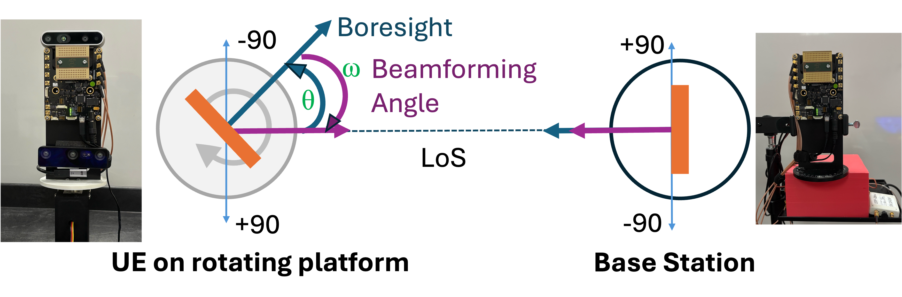
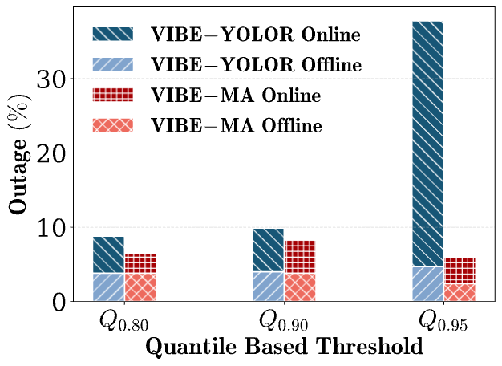

# Indoor experiments

Indoor evaluations of VIBE on the CPN Lab testbed with the UE rotor sweeping continuously. Each algorithmic variant has its own self-contained subfolder under [continuous/](continuous/).

<p align="center">
  
</p>

## Layout

```
indoor/
└── continuous/                                 # rotor sweeps continuously (the only indoor evaluation tree)
    ├── online/                                 # live-SNR measurement
    │   ├── automatic_indoor_evaluations_basic/         # VIBE-YOLOR (camera prior only)
    │   ├── automatic_indoor_evaluations_mavg/          # VIBE-MA (canonical reference variant)
    │   ├── automatic_indoor_evaluations_mavg_absent/   # VIBE-MA ablation (no history fallback)
    │   ├── automatic_indoor_evaluations_mlp/           # VIBE-MLP (learned offset)
    │   └── automatic_indoor_evaluations_5gnr/          # 5G NR hierarchical baseline
    └── offline/                                # SNR replayed from pre-collected ground truth
        ├── automatic_indoor_evaluations_basic/         # VIBE-YOLOR
        ├── automatic_indoor_evaluations_mavg/          # VIBE-MA
        ├── automatic_indoor_evaluations_mavg_absent/   # VIBE-MA ablation
        └── automatic_indoor_evaluations_mlp/           # VIBE-MLP
```

The 5G NR baseline has no offline counterpart by design — it is only meaningful with real-time SNR. See [continuous/README.md](continuous/README.md) for the full matrix and per-folder details.

## Naming conventions

| Token | Meaning |
|---|---|
| `_basic` | VIBE-YOLOR — camera priming + radio projection only, no closed loop |
| `_mavg` | VIBE-MA — moving-average offset tracking |
| `_mlp` | VIBE-MLP — learned offset prediction |
| `_5gnr` | 5G NR hierarchical beamforming baseline |
| `_absent` | Ablation: offset-history fallback disabled |
| `online/` | Real-time SNR measurement |
| `offline/` | Replayed SNR from pre-collected ground truth |

## Hardware and prerequisites

Sivers EVK06002 TX/RX (60 GHz), USRP B200-mini, Arduino-driven rotor, RX-side camera (Intel RealSense or Luxonis OAK-D), and a YOLO inference service running on the UE-side host (not required for the 5G NR baseline). See [../docs/HARDWARE.md](../docs/HARDWARE.md) for wiring, calibration, and beam-book details.

Before running anything, edit [../configurations/config.py](../configurations/config.py): `PROJECT_ROOT`, `JETSON_IP`, `NUC_IP`, `serial_port`, and the camera intrinsics.

## Outputs

Each experiment writes under `<runner-folder>/Adaptive_Beamforming_SC/<experiment_name>/` (gitignored). Per-step results land in `results_<experiment_name>.csv`; the run's config snapshot lives in `experiment_metadata.json`. Per-folder terminal logs (`automatic_evaluation_terminal_log.txt`, etc.) are also gitignored.

## Results

<p align="center">
  
</p>

Author: Apala Pramanik
