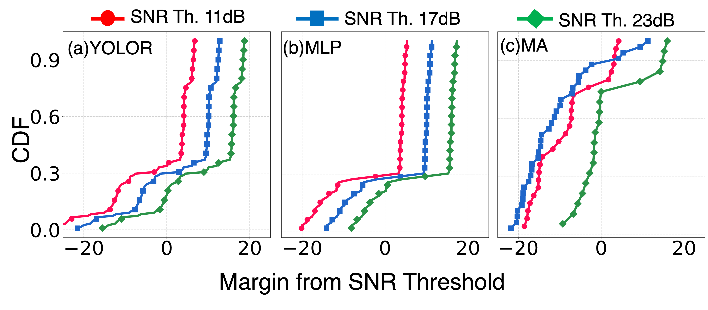

# Outdoor experiments

Outdoor real-time evaluation of VIBE on the UNL campus — UE radio mounted on a vehicle moving along an 80 m straight path at 1.6 / 8.0 / 12.8 °/s.

Unlike the indoor tree there is no offline (replayed-SNR) condition: outdoor evaluation is online-only, run a single experiment at a time, and the TX-side Sivers radio lives on a separate host that the runner talks to over the network.

<p align="center">
  
</p>

## Canonical runners

| Variant | File | Algorithm |
|---|---|---|
| **VIBE-YOLOR** (camera prior only) | `outdoor_online_main_basic.py` | Set RX beam to YOLO-predicted index; no closed loop. |
| **VIBE-MA** (moving-average offset, main proposed) | `outdoor_online_main_mavg.py` | YOLO → MA-history correction → neighbor search. |
| **VIBE-MLP** (learned offset) | `outdoor_online_main_mlp.py` | YOLO → learned `OffsetMLP` predicts offset → one-shot correction. |

All three use **ZMQ REQ-REP** to control the remote TX host (`tcp://<NUC_IP>:5555`). The TX Sivers radio is initialized and driven by a small server on the TX host; the runner sends `START_TX` + per-step `SET_TX_BEAM:<idx>` messages and waits for acks.

For alternative deployment topologies (raw-TCP TX server, or single-host USB-attached TX) see [alt_runners/](alt_runners/).

## Layout

```
outdoor/
├── outdoor_online_main_{basic,mavg,mlp}.py   # canonical runners (ZMQ to remote TX)
├── sivers_control.py / usrp_control.py / uhd_conf.py / imports.py   # local hardware shims
├── alt_runners/      # alternative-transport runners (raw-TCP, USB-local)
├── fullsweep/        # exhaustive TX×RX beam-sweep tooling (ground-truth capture + heatmap)
├── mlp_training/     # build training dataset + train OffsetMLP
└── mlp_models/       # captured datasets, fitted input scalers, trained .pt weights
```

Each subfolder has its own README with run instructions.

## Prerequisites

1. **Hardware up.** Sivers EVK06002 RX (local) and TX (remote host), USRP B200-mini, RX-side camera (Intel RealSense D435 or Luxonis OAK-D). See [../docs/HARDWARE.md](../docs/HARDWARE.md).
2. **YOLO service** running on the UE-side host listening at `JETSON_IP:PORT` (TCP). The runner sends `DETECT:<rotor_angle>:<timestamp>` and expects a beam index (or `NO_RADIO`) in reply.
3. **TX-side server** running on the TX host listening at `tcp://<NUC_IP>:5555` (ZMQ REP). Accepts `START_TX` (initial Sivers setup handshake) and `SET_TX_BEAM:<idx>` (per-step).
4. **Config edited.** In [../configurations/config.py](../configurations/config.py), set `PROJECT_ROOT`, `JETSON_IP`, `NUC_IP`, `serial_port`, and the camera intrinsics.
5. **MLP weights** (VIBE-MLP only). See [mlp_models/](mlp_models/) and [mlp_training/](mlp_training/).

## Run

```bash
cd outdoor
python3 outdoor_online_main_mavg.py
```

The runner prompts for a `test_number` (e.g. `t1`) and writes the experiment under `Outdoor_Adaptive_Beamforming_SC/<variant>_Results/<location>_<date>_gain<gain>_<distance>_<test_number>/`. The output tree is gitignored.

## Outputs

Each run writes:
- `results_<experiment_name>.csv` — per-step log (boresight angle, YOLO-predicted beam, selected beam, SNR, adjustment method, beam-sweep time).
- `experiment_metadata.json` — config snapshot.
- Sivers RX log (`logfile_rx.txt`).

## Results

<p align="center">
  
</p>

Author: Apala Pramanik
